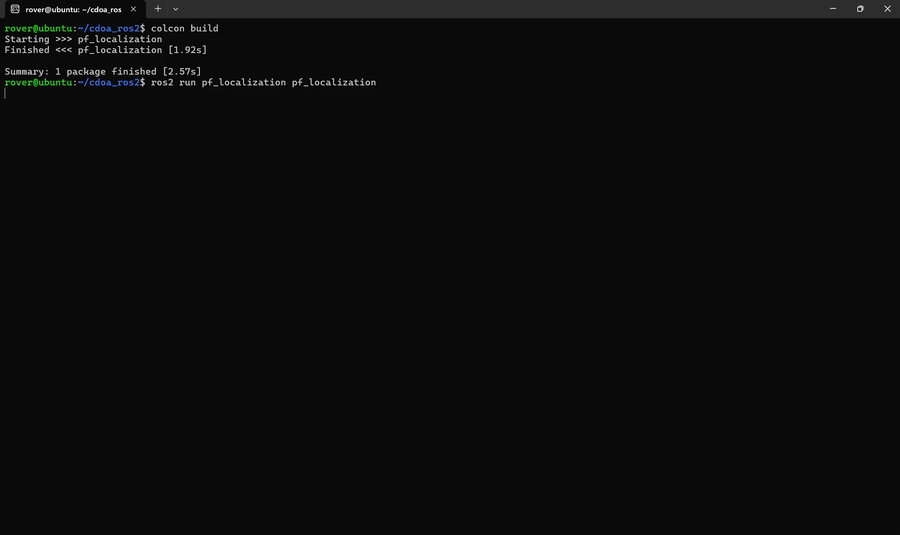

# cdoa-ros2

ROS 2 workspace for my master’s project on wireless robotic localization using Particle Filter (PF) estimation and Collaborative Direction of Arrival (CDoA) principles.

This work is based on the paper:

Latif, E., and Parasuraman, R., **"Instantaneous Wireless Robotic Node Localization Using Collaborative Direction of Arrival,"** *IEEE Internet of Things Journal*, vol. 11, no. 2, pp. 2783-2795, 2024. doi:10.1109/JIOT.2023.3296334

The repository focuses on extending the method into a practical ROS 2 implementation for real robot platforms:
- Rover Robot MAX
- Husarion ROSbot 2 Pro

## Project Motivation

Accurate localization in indoor and GPS-denied environments remains challenging, especially when only noisy wireless measurements are available. This project investigates how RSSI-driven directional inference and PF-based state estimation can be combined into a deployable ROS 2 stack for multi-robot systems.

The current implementation provides:
- A ROS 2 PF localization package that consumes wireless and robot motion data
- A ROS 2 network analysis package that provides wireless quality and network performance measurements

## Current Scope

- ROS 2 PF localization prototype is implemented in [src/pf_localization](src/pf_localization)
- ROS 2 network measurement utilities are available in [src/ros2-network-analysis](src/ros2-network-analysis)
- ROS 2 wireless communication integration for the full deployment is work in the future

## Repository Layout

```text
cdoa-ros2/
  README.md
  report.pdf
  paper.pdf
  src/
    README.md
    pf_localization/
      README.md
      launch/
      pf_localization/
      package.xml
      setup.py
    ros2-network-analysis/
      README.md
      launch/
      msg/
      srv/
      scripts/
      src/
      package.xml
```

## Quick Start

For complete run instructions, see [src/README.md](src/README.md).

From the repository root:

```bash
colcon build --symlink-install
source install/setup.bash
```

For localization runs with the real robot setup (4 wireless Raspberry Pi 5 nodes + 1 robot), follow:
- [src/README.md](src/README.md) -> **Multi-Robot Localization Deployment (4 Raspberry Pi 5 Nodes)**

This includes:
- SSH/login flow for each node (password: `herolab`)
- `source /opt/ros/jazzy/setup.bash` on each node
- Running `ros2_network_analysis`
- Launching `pf_localization` from either robot

## Localization Demo (3x Speed)

Click the preview to open the sped-up video:

[](localization_3x.mp4)

## Documentation Map

- Workspace run guide: [src/README.md](src/README.md)
- PF localization package: [src/pf_localization/README.md](src/pf_localization/README.md)
- Wireless/network analysis package: [src/ros2-network-analysis/README.md](src/ros2-network-analysis/README.md)

## Roadmap

- Integrate full ROS 2 wireless communication pipeline used in experiments
- Clean up package metadata and parameter interfaces
- Add reproducible experiment launch profiles for Rover Robot MAX and ROSbot
- Add evaluation scripts and result logging for thesis figures/tables

## Citation

If you use this repository in academic work, please cite the original paper:

Latif, E., and Parasuraman, R., "Instantaneous Wireless Robotic Node Localization Using Collaborative Direction of Arrival," *IEEE Internet of Things Journal*, vol. 11, no. 2, pp. 2783-2795, 2024. doi:10.1109/JIOT.2023.3296334

DOI:
- https://doi.org/10.1109/JIOT.2023.3296334

BibTeX:

```bibtex
@article{latif2024instantaneous,
  author  = {Ehsan Latif and Ramviyas Parasuraman},
  title   = {Instantaneous Wireless Robotic Node Localization Using Collaborative Direction of Arrival},
  journal = {IEEE Internet of Things Journal},
  volume  = {11},
  number  = {2},
  pages   = {2783--2795},
  year    = {2024},
  doi     = {10.1109/JIOT.2023.3296334}
}
```

